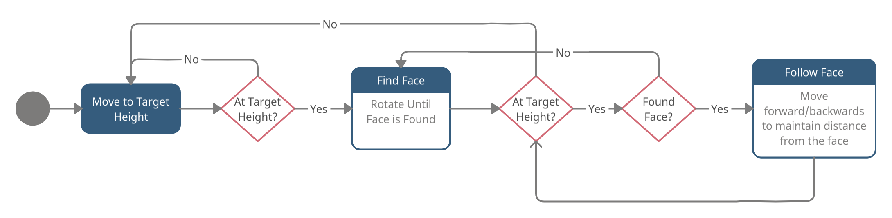

# Drone Face Following

## What is it?
A program that will do 3 things:
1) Fly to drone to a set height first.
2) Rotate until it finds a human face.
3) Once found it will try to stay a certain distance from the face, even if you move back and forth.

## Installations:
Notably it uses [DJITelloPy](https://github.com/damiafuentes/DJITelloPy/), [yoloface](https://github.com/sthanhng/yoloface) and [simple-pid](https://github.com/m-lundberg/simple-pid). To Install every dependency run:

`pip install -r requirements.txt`

## How to use? 
Connect to the drone's wifi and run:

`python main.py`

**Make sure the enviroment is well illuminated, if you get "invalid imu" errors it's because the imu needs more light**.

To land the drone after the program is running you can do a keyboard interrupt (Ctrl C).

## How it Works?

The program is a implementation of the state machine below: 

Every command to Tello is done with the [DJITelloPy](https://github.com/damiafuentes/DJITelloPy/) library. [Yoloface](https://github.com/sthanhng/yoloface) is used to find the the face. A PID controller is used to mantain the distance from the face, once it's found, the PID controller was tuned with [PID Tuner](https://pidtuner.com/#/) and Implemented with [simple-pid](https://github.com/m-lundberg/simple-pid).
